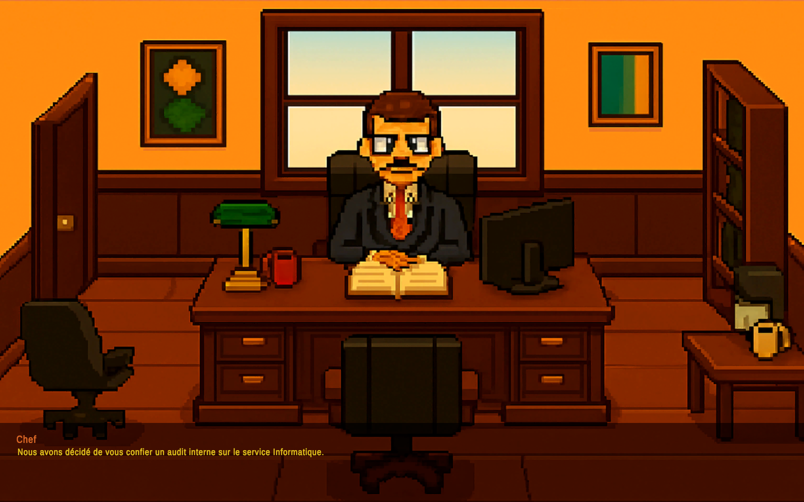
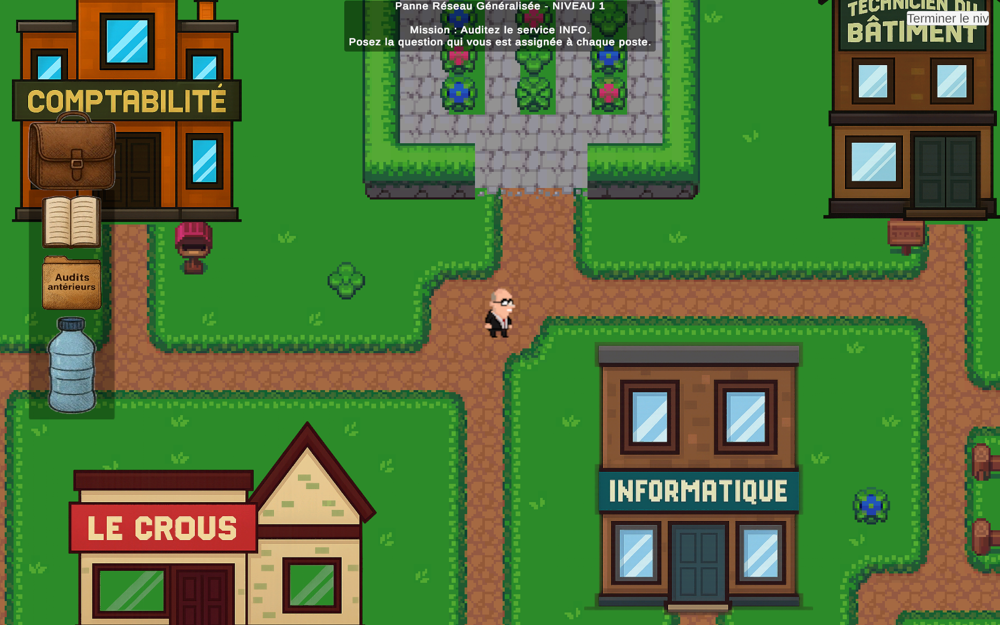
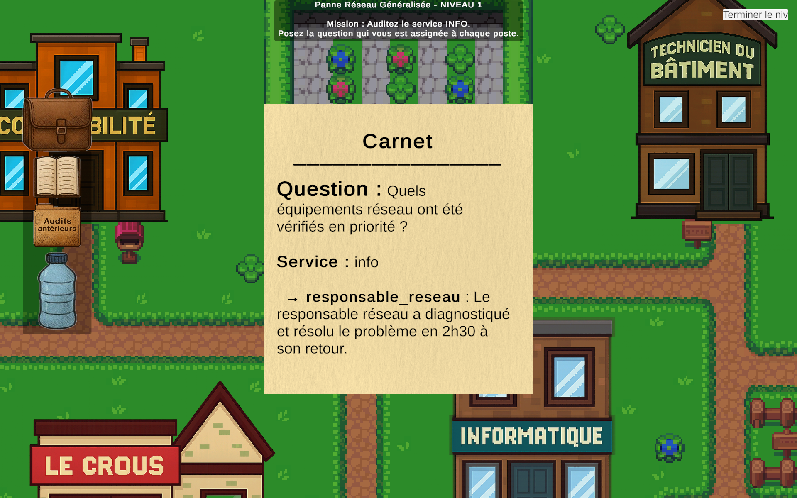
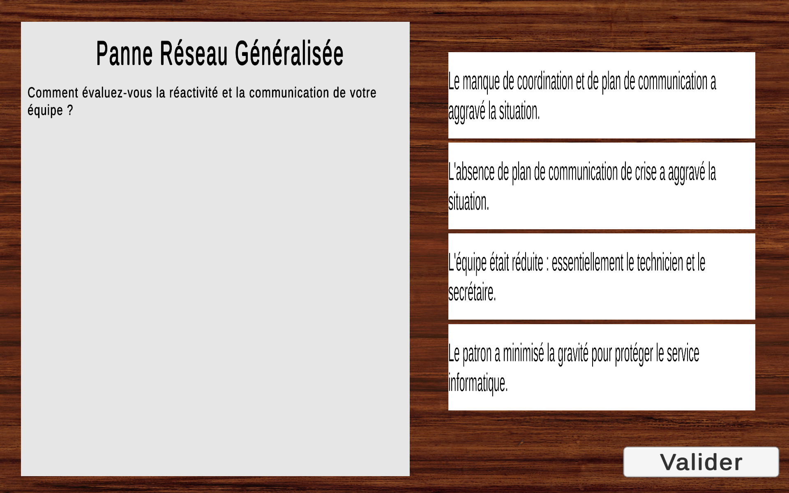
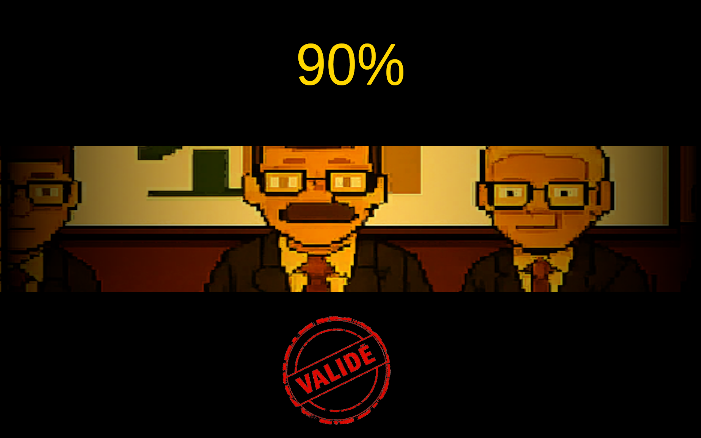

# Audit Royal
**Groupe : MET25-C-A**  

**Participants :**  
- Fouilleul Elora  
- Muharremoglu Açelya  
- Zou Valentin  
- Hellich Alexis  

---

## Présentation du projet
**Audit Royal** est un **jeu sérieux** permettant de découvrir le métier **d’auditeur interne dans une université**.  
Le joueur expérimente la **réalisation d’un audit**, apprend à **collecter des informations**, à **interagir avec les employés** et à **rédiger un rapport**.  

L’objectif est de donner aux débutants un **avant-goût concret de leur premier audit** et de leur faire comprendre la complexité des échanges humains et des choix à prendre en fonction du caractère des personnes auditées.

Pour en savoir plus sur le métier et les objectifs pédagogiques, consultez notre [Wiki](Wiki.md).

---

## Contraintes de développement
- Le jeu doit permettre des **scénarios différents à chaque partie**.  
- Les **données aléatoires** influencent les parties (caractère des personnages, véracité des informations…).  
- Le joueur doit comprendre que ses choix impactent **le déroulement et le résultat de l’audit**.  
- Les fonctionnalités doivent couvrir :
  - Interaction avec plusieurs employés
  - Collecte et tri d’informations
  - Rédaction d’un rapport final

---

## Lien de téléchargement
> *À compléter : en cours de développement*

---

## Captures d'écran
Menu du jeu : <br><br>
<br><br>

Lorsqu'on démarre le jeu, le directeur de l'audit nous assigne une mission : <br><br>
<br><br>

Ensuite, c'est à vous de vous déplacer dans la map pour aller questionner les personnages : <br><br>

<br><br>

Tout au long de la partie vous pourrez vous aider des éléments présents dans votre sac à dos afin de suivre l'avancement de votre audit : <br><br>

<br><br>

Une fois que vous avez récolté suffisamment d'informations vous pouvez passer au niveau supérieur en rédigeant un rapport : <br><br>
<br><br>

Après avoir rédigé le rapport, vous devrez ensuite faire face au conseil d'administration qui validera ou non votre rapport : <br><br>

<br><br>

Vous devrez suivre l'ensemble de ces procédures pour les 5 niveaux. Votre objectif : valider le plus de rapport possible par le conseil d'administration.

---

## Procédures d'installation et d'exécution

### Linux
```bash
git clone  https://git.unistra.fr/met25-c-t3-a/audit_royal
chmod +x exec.x86_64
./exec.x86_64
```

---

## Documentation
- Pour comprendre les objectifs pédagogiques et les fonctionnalités : [Wiki](Wiki.md)

- La documentation du code a été générée automatiquement à partir des scripts C# du projet Unity.

### 🔧 Génération de la documentation

Un script Python permet de générer une documentation HTML à partir du fichier XML produit par Unity (`Assembly-CSharp.xml`).

Commande utilisée :

```bash
python3 doc_generator.py Library/ScriptAssemblies/Assembly-CSharp.xml
```

La documentation est générée dans le dossier :

```bash
documentation_html/
```

👀 Consultation de la documentation

Ouvrir le fichier suivant dans un navigateur :

```bash
documentation_html/index.html
```

Ou via le terminal :

```bash
xdg-open documentation_html/index.html
```